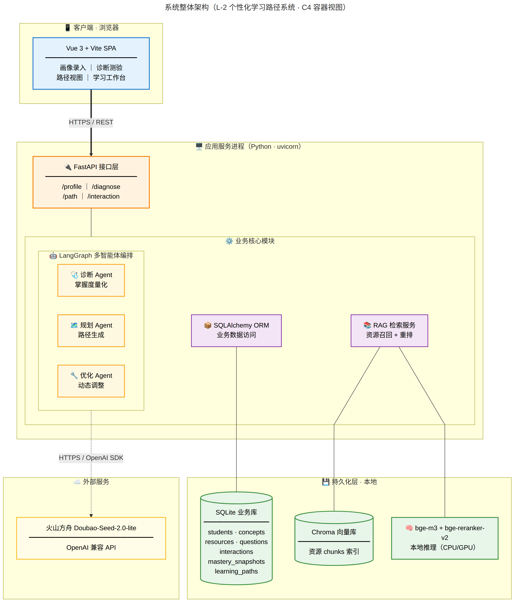
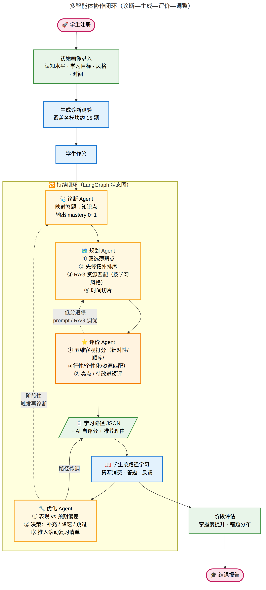

# L-2 项目架构与工作流

**项目**：AI 赋能下的个性化学习路径系统  
**用途**：5.8 上机课方向对齐 / 项目内部协同  
**版本**：2026-05-08

> 本文件包含两类视图：
> - **§一 系统整体架构** —— 静态结构视图（C4 容器级），描述系统由哪些部署单元组成、它们如何联通；
> - **§二 诊断—生成—调整 工作流** —— 动态时序视图，描述学生使用过程中各 Agent 的协作流程与触发节奏。
>
> 两者互补：架构图回答"系统由什么组成"，工作流图回答"它如何运转"。

---

## 一、系统整体架构（C4 容器视图）



### 部署单元说明

按"运行时进程边界"划分四大单元：

| 单元 | 边界 | 内含组件 |
|------|------|---------|
| **客户端** | 用户浏览器 | Vue 3 + Vite SPA |
| **应用服务进程** | 一个 uvicorn 进程 | FastAPI 接口层 + LangGraph 编排 + SQLAlchemy ORM + RAG 检索服务 |
| **持久化层** | 应用同机本地 | SQLite 业务库、Chroma 向量库、bge-m3 / reranker 本地模型 |
| **外部服务** | 网络 | 火山方舟 Doubao（OpenAI 兼容 API） |

### 组件职责

| 组件 | 选型 | 职责 |
|------|------|------|
| **前端 SPA** | Vue 3 + Vite | 学生交互入口：画像录入、诊断测验、路径视图、学习工作台 |
| **API 接口层** | FastAPI | 暴露 REST 端点（/profile、/diagnose、/path、/interaction） |
| **多智能体编排** | LangGraph | 状态图驱动诊断 / 规划 / 优化三 Agent 协作 |
| **ORM 数据访问** | SQLAlchemy | 业务表 CRUD 抽象 |
| **RAG 检索服务** | LlamaIndex | 资源召回（Chroma 向量库）+ 重排（bge-reranker） |
| **关系数据库** | SQLite | 7 张业务表（students / concepts / resources / questions / interactions / mastery_snapshots / learning_paths） |
| **向量数据库** | Chroma | 学习资源 chunk 向量索引 |
| **嵌入与重排模型** | bge-m3 / bge-reranker-v2-m3 | 本地推理，免外部 API 调用 |
| **大语言模型** | 火山方舟 Doubao-Seed-2.0-lite | Agent 推理（诊断分析、路径生成、调整决策） |

### 关键架构决策

- **单进程聚合**：FastAPI、LangGraph、ORM、RAG 服务运行在同一个 Python 进程内，模块间通过函数调用而非 RPC，部署简单、延迟低；
- **同机持久化**：所有数据库（SQLite、Chroma）与应用同机部署，零网络运维成本；
- **唯一外部依赖**：仅 LLM 调用走出网（火山方舟 OpenAI 兼容 API），离线时其他功能仍可调试；
- **跨域**：前端与后端不同端口（5173 vs 8000），需 FastAPI 配置 CORS 中间件。

---

## 二、诊断—生成—调整 工作流（时序视图）

> ⚠️ 这张是**工作流图（state machine / activity diagram）**，描述学生使用过程中三个 Agent 如何被触发、如何衔接、如何形成闭环。它不是架构图。



### 三 Agent 职责切分

| Agent | 输入 | 处理 | 输出 |
|-------|------|------|------|
| **🩺 诊断 Agent** | 学生画像 + 答卷 | LLM 分析每题考点与错因，映射到知识点掌握度 | `{concept_id: mastery_0~1}` |
| **🗺️ 规划 Agent** | 掌握度向量 + 知识图谱 + 资源库 + 时间约束 | ① 筛选薄弱知识点 ② 先修拓扑排序 ③ RAG 匹配资源 ④ 时间切片 | 学习路径 JSON + 推荐理由 |
| **🔧 优化 Agent** | 当前路径 + 最新交互（答题/用时/反馈） | ① 表现 vs 预期偏差识别 ② 决策：补充/降速/跳过 ③ 推入滚动复习 | 更新后路径 + 调整理由 |

### 闭环触发节奏

- **首次启动**：学生注册 → 画像录入 → 诊断测验 → 完整 3 Agent 链路；
- **学习过程中**：每完成一节资源/答一组题 → 仅触发优化 Agent 做路径微调；
- **阶段性**（如每周末或每章节末）：触发优化 Agent → 决定是否再次启动诊断 Agent 做完整复诊。

### 与课程要求的对应

| 课程要求 | 本设计的对应 |
|---------|-------------|
| **诊断—生成—调整闭环** | 三 Agent 显式分工，状态在 LangGraph 节点间流转，符合"闭环"语义 |
| **可解释推荐** | 规划/优化 Agent 输出路径时附带"推荐理由"字段，供前端展示 |
| **个性化** | 诊断输出 + 学习风格 + 时间约束三维度共同决定路径，非简单行为协同 |
| **动态调整** | 优化 Agent 的"路径微调"和"再诊断触发"是两条独立调整链路 |

---

## 三、技术选型理由速览

| 选型 | 替代方案 | 选用理由 |
|------|---------|---------|
| LangGraph | LangChain Agent / AutoGen / 手写 | 状态图清晰，"诊断—生成—调整"天然契合状态机抽象，调试与追踪方便 |
| Chroma | FAISS / Qdrant / Milvus | 文件型本地库，零运维；学生项目交付简单 |
| bge-m3 | OpenAI Embedding / text2vec | 中文开源 SOTA，免费、私有化无门槛 |
| FastAPI | Flask / Django | 自带 Swagger 文档，类型安全，与 Pydantic 协同好 |
| SQLite | PostgreSQL / MySQL | 文件即数据库，演示和迁移成本最低 |
| Vue 3 + Vite | React / Streamlit / Gradio | 团队前端同学技术栈对齐 Vue；组件化 + TS 支持好；Vite 启动/HMR 快；独立前端工程便于前后端并行开发 |

---

## 附：源码位置

| 文件 | 内容 |
|------|------|
| `docs/diagrams/系统架构.mmd` | 系统整体架构 Mermaid 源码 |
| `docs/diagrams/多智能体闭环.mmd` | 闭环协作 Mermaid 源码 |
| `docs/images/系统架构.png` | 渲染产物 |
| `docs/images/多智能体闭环.png` | 渲染产物 |

如需修改架构图，编辑 `.mmd` 后运行：

```bash
PUPPETEER_EXECUTABLE_PATH=/usr/bin/google-chrome \
  mmdc -i docs/diagrams/系统架构.mmd \
       -o docs/images/系统架构.png \
       -w 2800 -b white --scale 2
```
